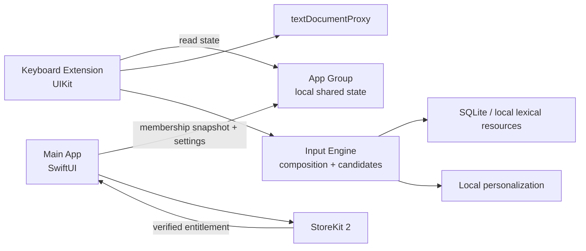

# Architecture

```mermaid
flowchart LR
  App[Main App\nSwiftUI] -->|membership snapshot + settings| Group[App Group\nlocal shared state]
  Extension[Keyboard Extension\nUIKit] -->|read state| Group
  Extension --> Proxy[textDocumentProxy]
  Extension --> Engine[Input Engine\ncomposition + candidates]
  Engine --> Lexicon[SQLite / local lexical resources]
  Engine --> Learning[Local personalization]
  App --> StoreKit[StoreKit 2]
  StoreKit -->|verified entitlement| App
```

This diagram describes the production architecture at a high level. The complete production implementation, dictionaries, ranking models, and configuration remain private.
